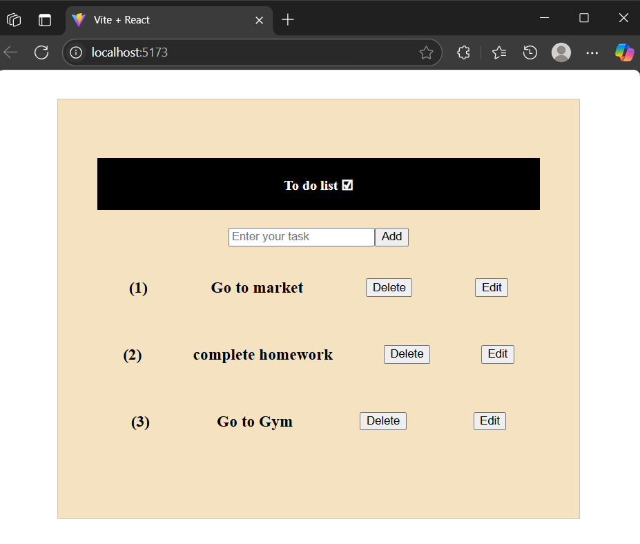

# 📝 Todo List App

A simple and efficient Todo List application built with **React** and **Vite**.



## 🚀 Features

- Add and delete todos  
- Fast and modern Vite-based development setup

## 📦 Tech Stack

- [React](https://reactjs.org/)
- [Vite](https://vitejs.dev/)
- [ESLint](https://eslint.org/)

## 🛠️ Installation & Setup

1. **Clone the repository**
   ```bash
   git clone https://github.com/Shiv2385/To-Do-List.git
   
2. **Install dependencies**
   ```bash
     npm install

3. **Start the development server**
   ```bash
   npm run dev

